```{r setup, include=FALSE}
knitr::opts_chunk$set(echo = TRUE)
```

## Section 1: Executive Summary

**Project Overview:** The primary aim of this project is to develop predictive models capable of estimating the rating of a given movie. The utilization of both foundational and advanced Machine Learning techniques is intended to be employed in order to achieve an enhanced level of predictive accuracy.

**Dataset Description:** A comprehensive dataset containing information related to 10 million movies, as well as movie ratings from the MovieLens dataset, will be leveraged for this project. The MovieLens dataset, which has been available since 1998, captures individuals' expressed preferences for movies in the form of tuples, each reflecting a person's rating (ranging from 0 to 5 stars) for a specific movie at a given time. [^1] Further in this paper, histograms of the distribution of key features of the dataset are included. 

[^1]: Source: https://paperswithcode.com/dataset/movielens

**Modelling Techniques:** Initially, a rudimentary model will be developed and employed as a baseline for assessing the performance of subsequent models. As the project progresses, sophisticated Machine Learning algorithms, specifically Xgboost, LightGBM, and Random Forest, will be utilized to establish models that demonstrate elevated levels of predictive efficacy. In addition, techniques, such as cross-validation, will be applied to avoid model over fitting.

**Feature Engineering:** Concurrently with the utilization of robust algorithms, a phase of data transformation will be undertaken to engineer new variables aimed at enhancing the predictive potential of the movie rating models.

**Model Assessment:** Model performance evaluation will be conducted by means of the Root Mean Square Error (RMSE) metric. This metric will be utilized as a quantifiable benchmark for the assessment of the accuracy of the predictive models in their estimation of movie ratings.

**1.1. Data Exploration** 

To gain a deeper insight into the data, we embarked on an exploration of its various distributions. Initially, we visualized the distribution of ratings (see chart below). Our analysis revealed a pronounced inclination towards positive ratings, with ratings of 3 and 4 emerging as the most prevalent, while ratings of 1 and 2 were notably less frequent. 

Next, we deep-dove into the distribution of average ratings per user, which exhibited a normal distribution. The mean rating stood at 3.512, with a median of 4, indicating a relatively symmetric distribution.

Furthermore, we examined the distribution of movie genres within the dataset. It became evident that drama and comedy genres held the majority, followed by thriller, romance, and action genres in descending order of prevalence. As we proceed with data preparation, we will calculate the 'genre effect' by computing the variance of ratings across different movie genres.

```{r, echo=FALSE, out.width="70%", fig.align="center"}

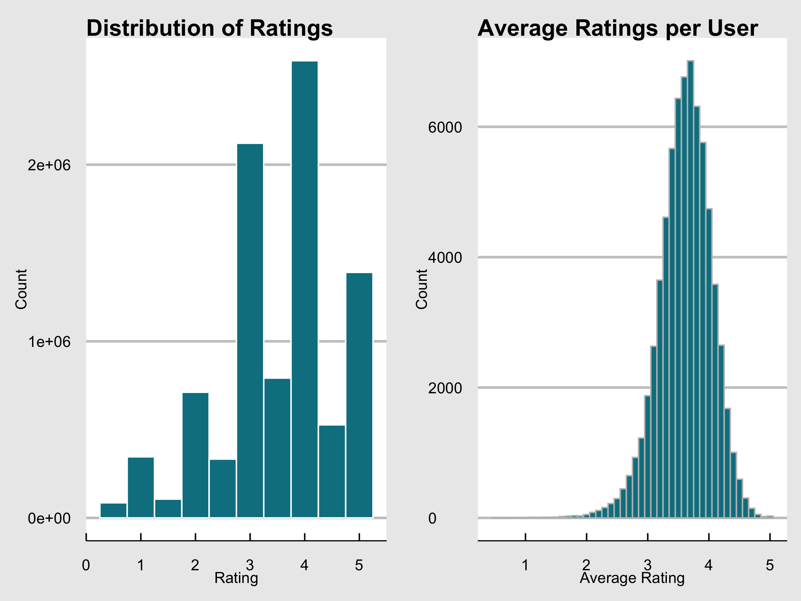

```

```{r, echo=FALSE, out.width="70%", fig.align="center"}

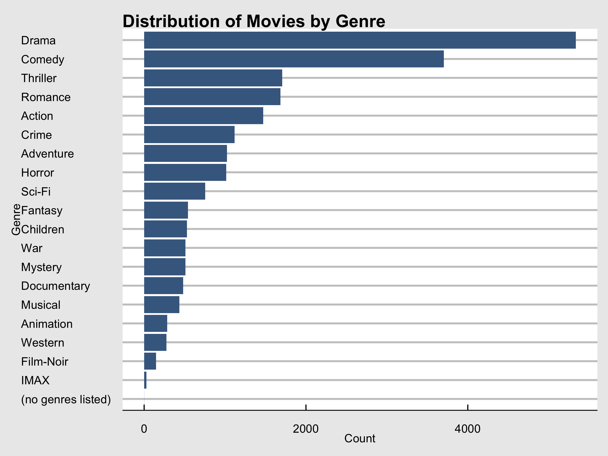

```

\newpage
## Section 2. Methodology and techniques

*2.a. Traditional approaches*

During this analysis, we employed traditional techniques to uncover potential biases influencing the average rating for each movie. However, due to the limited computational capabilities of my laptop, we resorted to a common practice of utilizing random sampling to represent the larger dataset. This approach facilitated faster processing times, allowing for the testing of various methodologies while yielding similar results.

To kick off the analysis, we established a benchmark model for the purpose of comparing the performance of predictive models against it. This benchmark was predicated on the assumption that the predicted rating for all movies would be a simple average of all ratings, specifically 3.512. Given the elementary nature of this prediction method, it's important to note that the model exhibits a substantial prediction error, as evidenced by the uneven distribution of residuals.

```{r, echo=FALSE, out.width="50%", fig.align="center"}

knitr::include_graphics("residuals_plot.png")

```

Similar to the case-study on the edx platform, the first bias to be isolated was the 'movie effect'. The second bias identified was the 'user effect', indicating variations in rating tendencies among users, with some consistently assigning higher ratings and others displaying more critical tendencies, resulting in lower ratings.

```{r, echo=FALSE, out.width="50%", fig.align="center"}

knitr::include_graphics("movie_effect.png")

```

Additional biases were also uncovered, such as the 'day-of-the-week bias'. Average ratings exhibited variations depending on the specific day of the week. This phenomenon could be attributed to multiple factors, such as distinct user behaviors on weekdays versus weekends, variations in movie types being rated on different days, and the general mood of users during the week versus the weekend impacting their movie ratings.

```{r, echo=FALSE}
read.csv("day_effect.csv")

```

Later in the project, we calculated the bias attributed to the movie genre. The plot below shows the variance of rating across the several movie genres combinations.

```{r, echo=FALSE, out.width="70%", fig.align="center"}

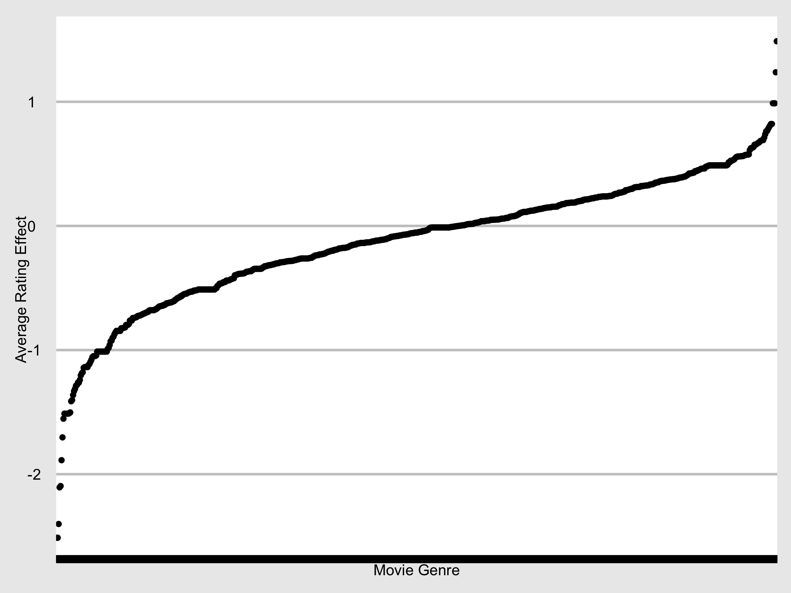

```
```{r, echo=FALSE}
# Read the CSV file
data <- read.csv("genre_effect.csv")

# Print the top 10 rows
head(data, n = 10)
```

*2.b. Machine Learning algorithms*

Later in the analysis, more robust approaches were introduced, involving machine learning algorithms such as Xgboost, LightGBM, and Random Forest.

To understand the impact of each algorithm, the same set of features was retained for all three algorithms.

2.b.1. Xgboost: *XGBoost is an optimized distributed gradient boosting library designed to be highly efficient, flexible and portable. It implements machine learning algorithms under the Gradient Boosting framework. XGBoost provides a parallel tree boosting (also known as GBDT, GBM) that solve many data science problems in a fast and accurate way. The same code runs on major distributed environment (Kubernetes, Hadoop, SGE, Dask, Spark, PySpark) and can solve problems beyond billions of examples.* [^2]

[^2]: Source: https://github.com/dmlc/xgboost

For Xgboost, the algorithm was initially used with a depth of tree limit of 9 levels and was allowed 25 boosting rounds to identify the optimal tree for predicting movie ratings. This process took approximately 2 hours. To enhance time efficiency and performance, parameter tuning was conducted. The depth of tree parameter, known to enhance performance, was set at 17, almost double the depth of the previous model. To expedite processing, the number of rounds was reduced to 15, based on the performance observations of the initial run. The processing time was also notably reduced to 55 minutes.

2.b.2. LightGBM: *LightGBM is a gradient boosting framework that uses tree based learning algorithms. It is designed to be distributed and efficient with the following advantages: Faster training speed and higher efficiency; Lower memory usage; Better accuracy; Support of parallel, distributed, and GPU learning; Capable of handling large-scale data.* [^3]

[^3]: Source: https://github.com/microsoft/LightGBM

For LightGBM, known for its computational efficiency, the training dataset size was increased to 0.5 million records. A maximum tree depth of 10 and 64 leaves per tree were chosen, with RMSE as the performance metric. These choices aimed to prevent overfitting. Given the algorithm's efficiency, it was allowed 400 boosting rounds to identify the best model, with a learning rate of 0.3. The processing time was significantly shorter compared to Xgboost.

In the final stage of our Light GBM modeling process, we harnessed the power of cross-validation to fine-tune our model's performance while guarding against the risk of overfitting. This pivotal step was executed with careful consideration of various parameters to ensure the best possible outcomes. Specifically, we configured our cross-validation procedure with the following key parameters: We opted for a 10-fold cross-validation scheme (`nfold = 10`). Furthermore, to expedite the model training process, we implemented early stopping after just 10 rounds without any discernible improvement (`early_stopping_rounds = 10`). Lastly, we set the verbosity level to 0 (`verbose = 0`) to minimize the amount of output generated during the cross-validation process, streamlining the overall workflow. This meticulous approach allowed us to maximize model performance and foster generalization, while maintaining control over potential overfitting concerns. The RMSE slightly increased at 0.96.

```{r, echo=FALSE, out.width="50%", fig.align="center"}

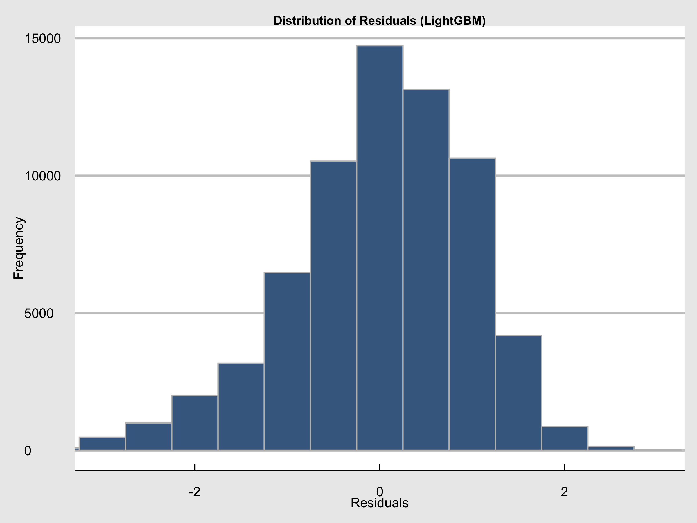

```

2.b.3. Random Forest: *Random forests or random decision forests is an ensemble learning method for classification, regression and other tasks that operates by constructing a multitude of decision trees at training time. For classification tasks, the output of the random forest is the class selected by most trees. For regression tasks, the mean or average prediction of the individual trees is returned.* [^4]

[^4]: https://en.wikipedia.org/wiki/Random_forest#cite_note-ho1995-1

For Random Forest, 100 trees were constructed by the algorithm. The vital parameter, mtry, representing the random feature set utilized in each tree, was determined using a technique based on the square root of the number of columns. This technique was not necessarily required in our project, as the number of attributes were limited, but this technique is very useful in projects with a larger number of attributes. The model achieved a RMSE of 1.02. We also applied a 5-fold cross-validation approach to find the best Random Forest model for the dataset based on the features. This cross-validation delivered a better RMSE of 0.96. The distribution of residuals is someway asymetric, as observed below.

```{r, echo=FALSE, out.width="50%", fig.align="center"}

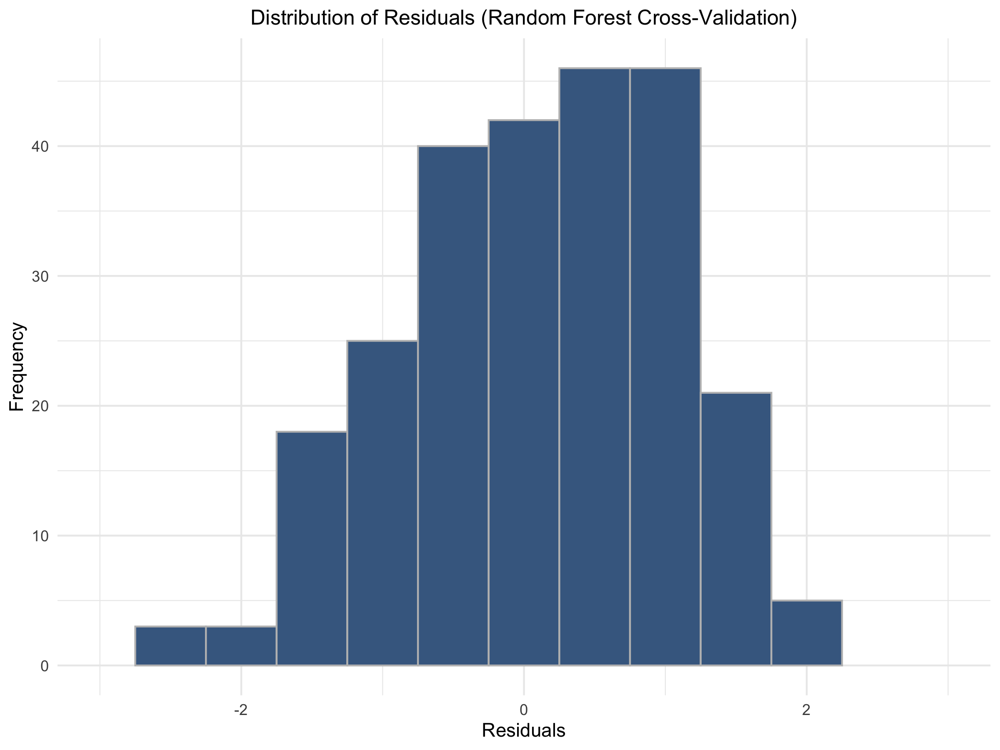

```

2.b.4. Light GBM including the genre effect (LightGBM Plus):

Since Light GBM has demonstrated remarkable speed advantages throughout this project, we have introduced a new variable to investigate the interplay between this variable and the algorithm's capacity. This variable, known as the 'genre effect', is determined by taking the difference between the genre-specific average ratings and the overall mean rating.

Following the fine-tuning of LGBM model parameters, the incorporation of the novel 'genre effect' feature led to an enhancement in model performance, as evidenced by a reduced RMSE of 0.96. It's worth highlighting that the distribution of residuals in this improved LGBM model closely mirrors the distribution observed in the previous LGBM model, indicating the consistency and stability of the model's predictive accuracy.

```{r, echo=FALSE, out.width="50%", fig.align="center"}

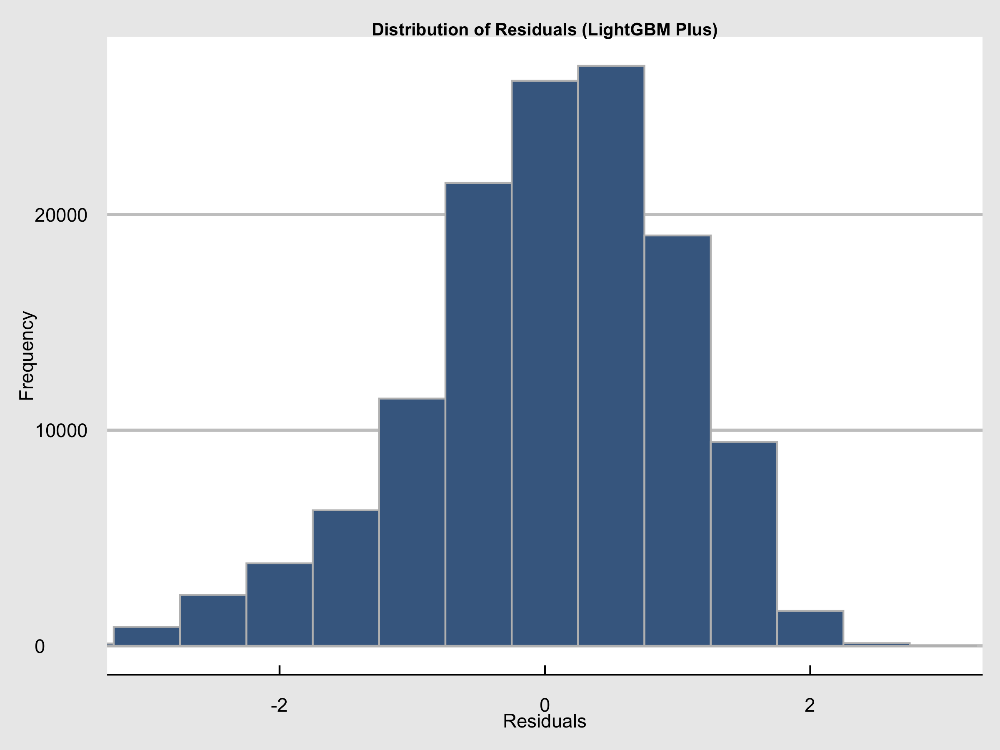

```

\newpage
## Section 3. Modeling Results

3.1. *Traditional models:* As mentioned earlier, traditional models accounting for biases such as user and movie effects produced an RMSE better than the benchmark of the simple rating average. Models incorporating these biases achieved RMSE values below 1 (0.97). Introducing additional biases, like day-of-the-week, yielded similar RMSE values (0.97). Subsequently, these biases were amalgamated to determine the combination that best predicted a movie's rating. The combination of biases did not delivered any substantial performance improvement, only reaching a RMSE of 0.97, representing a ~7% improvement versus the benchmark model.

3.2. *Machine Learning models:* Consequently, more intricate approaches were explored as mentioned above, namely ML-based methods like Xgboost, LightGBM, and Random Forest. Additionally, techniques such as cross-validation were employed to mitigate over itting.

The initial deployment of the Xgboost algorithm with a tree depth limit of 9 levels and 25 boosting rounds yielded a marginal improvement in RMSE, maintaining it at 0.97 compared to the baseline RMSE of 1.05. This performance parity with traditional methods came at the expense of substantial computational resources and a lengthy processing time of approximately 2 hours. However, after conducting parameter tuning, where the tree depth was increased to 17 (almost double the previous depth) and the number of rounds reduced to 15, the model's performance significantly improved. It achieved an RMSE of 0.91, representing a noteworthy ~13% reduction from the baseline RMSE of 1.05, while also reducing the processing time to just 55 minutes, as illustrated in this plot:

```{r, echo=FALSE, out.width="100%", fig.align="center"}

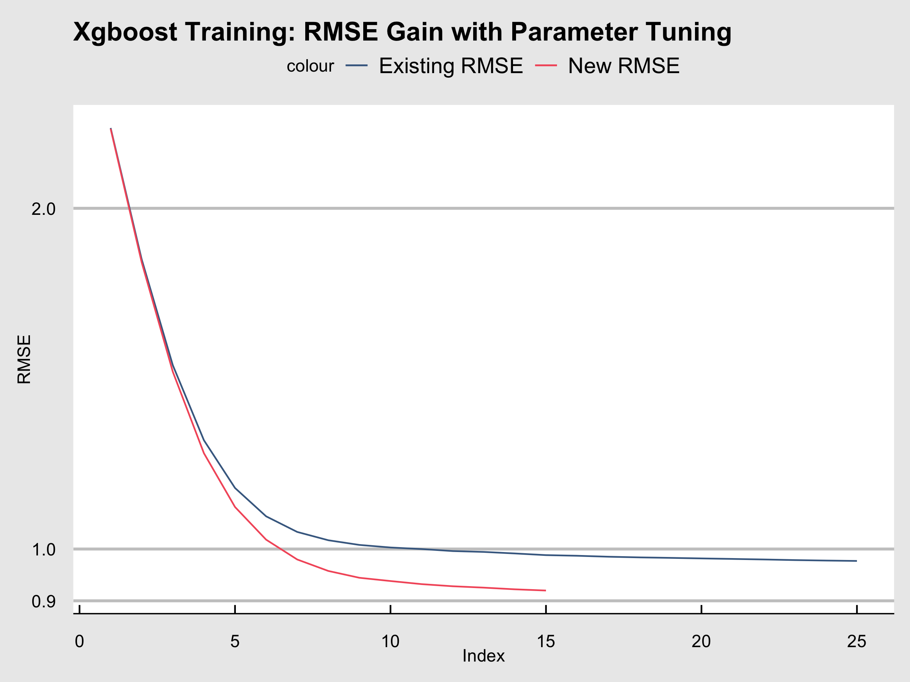

```

Among the models considered, LightGBM stood out for its efficiency, requiring less computing power and enabling the handling of larger datasets in less time, resulting in a RMSE of 0.95. On the other hand, Random Forest failed to surpass its predecessor's performance, achieving only a RMSE of 0.96, even after applying cross-validation. Prior to validation, the performance of these models was visually assessed through three plots: the Actual vs. Predicted plot, the Residual plot, and the Distributions of Residuals. The latter plots effectively showcased the dispersion between predicted and actual ratings, with a tighter distribution of residuals indicating improved model performance. The LightGBM-based model, including the genre effect feature, exhibited a superior performance, as evidenced by its tighter and more symmetrical distribution of residuals, as observed in the comparison of the distribution of residuals across techniques:

```{r, echo=FALSE, out.width="85%", fig.align="center"}

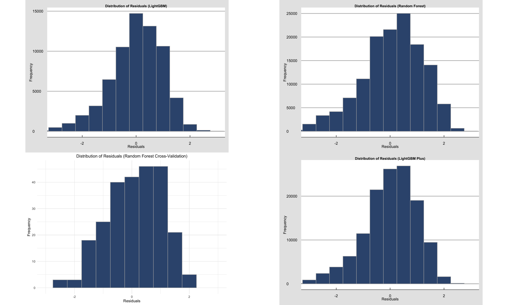

```

Lastly, when examining the distributions of actual versus predicted ratings via the LightGBM Plus approach, it becomes apparent that the ratings follow a normal distribution. Specifically, the model tends to over predict higher ratings while occasionally under predicting lower scores, providing valuable insights into its performance characteristics.

```{r, echo=FALSE, out.width="60%", fig.align="center"}

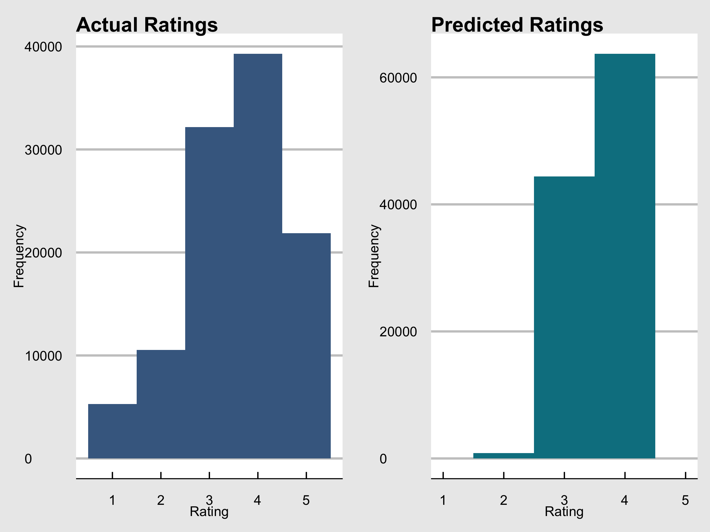

```

## Section 4: Model Validation on Hold-Out Test Dataset

Both LightGBM and Random Forest underwent validation using an out-of-sample hold-out test set. In addition to RMSE, we leveraged the Kolmogorov-Smirnov (KS) metric to comprehensively evaluate predictive model performance, with KS providing insights into how well the models capture the distribution of actual versus predicted values.

Validation of the LightGBM model resulted in an RMSE of 0.95, which raised concerns about potential overfitting during its development phase. The Random Forest model achieved an RMSE of 1.05 with the hold-out dataset, and when using the cross-validated model, its performance worsened, yielding an RMSE of 1.14.

The sole approach that managed to maintain an RMSE below 1 in the hold-out test set was the LightGBM Plus, which included the genre effect feature, delivering a RMSE of 0.98. This outcome highlights the effectiveness of incorporating genre-based information in improving predictive accuracy.

```{r, echo=FALSE, out.width="40%", fig.align="center"}

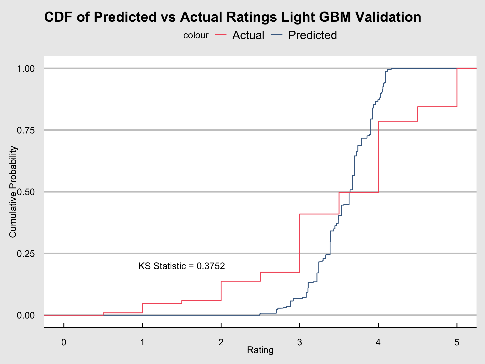

```

```{r, echo=FALSE, out.width="40%", fig.align="center"}

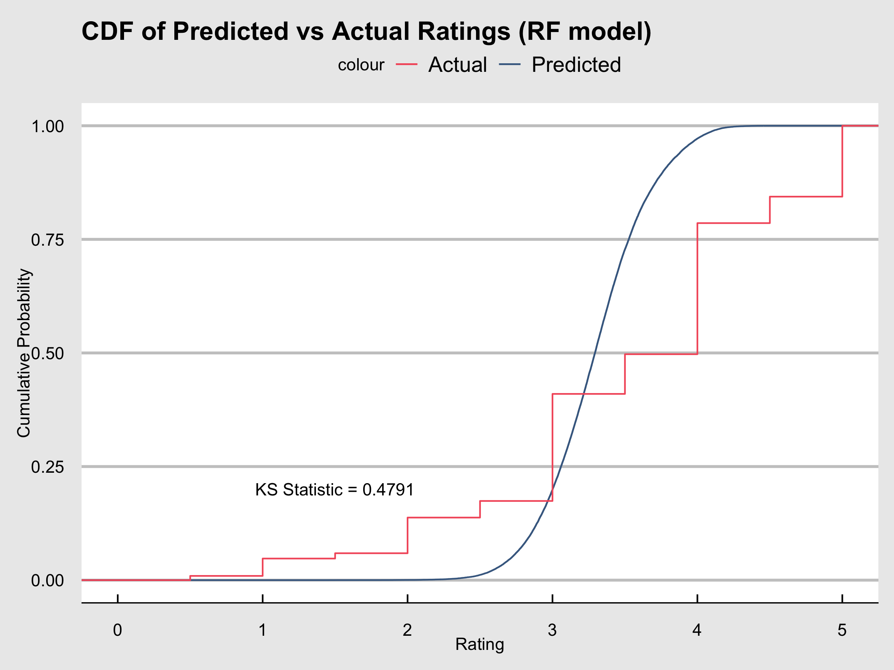

```
```{r, echo=FALSE, out.width="45%", fig.align="center"}

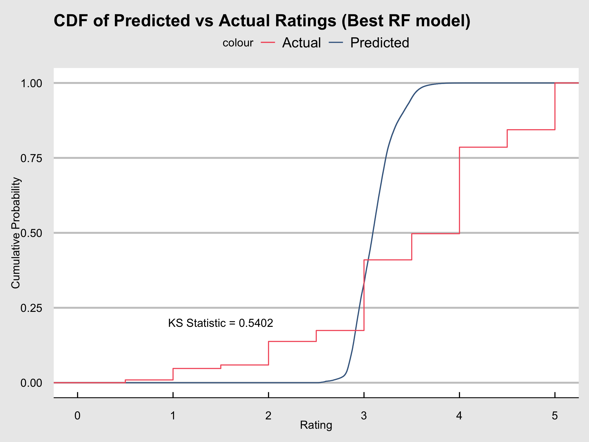

```

\newpage
## Section 5. Conclusion and future work

This project highlighted the superior performance of ML algorithms in building predictive models, albeit at the expense of increased computational requirements. This is one reason why many ML-based predictive models are hosted in cloud environments with advanced technology.

Furthermore, ML algorithms necessitate thorough data preparation, and these algorithms thrive on clean datasets, a process that demands time and effort. However, once data is properly prepared, parameter tuning becomes more efficient.

Additionally, different algorithms require varying levels of computational power. Future work could dive into whether this trend persists across different projects.

For future endeavors, clustering users based on their preferences to determine ratings is a prospective task. The creation of clusters might involve unsupervised ML techniques, which is a challenge I intend to tackle as part of my future work as a Data Scientist.

*Reviewed on Sep 22, 2023 8:45 pm AM*